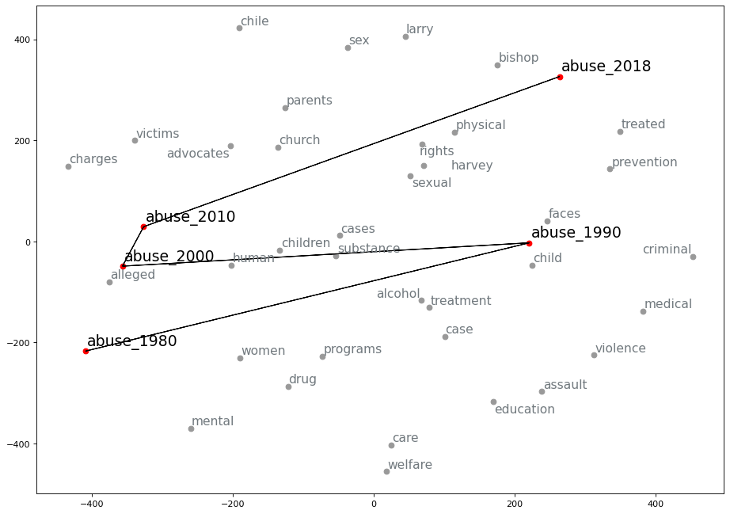

# Exploring Word2Vec with alignment methods for Contextual Event Tracking

## A Research Report

This is a research report for the Seminar "Advanced Text Mining Methods " at the TU Dortmund University. The report is written by Imene KOLLI.

